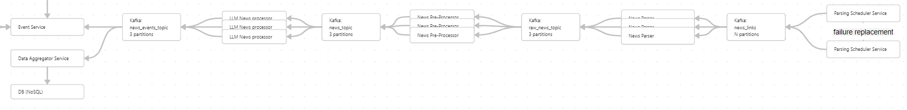

# LLM News Analyzer

LLM News Analyzer — это модуль проекта **MarketVision**, предназначенный для обработки и оценки новостных статей с использованием **Больших Языковых Моделей (LLM)**. Этот модуль помогает получать ценные инсайты из новостей, связанных с различными компаниями и отраслями, оценивая их инвестиционный потенциал на различные сроки. Результаты предоставляются пользователю через бота в Telegram.

## Поток работы

1. **Парсинг новостей**: Извлечение новостей с сайтов, сбор сырых данных.
2. **Предобработка**: Обработка сырых данных, выявление дубликатов, категоризация компаний, отраслей и тем.
3. **Оценка**: Оценка каждой статьи с точки зрения инвестиционного потенциала на разных сроках.
4. **Агрегация и хранение**: Обработанные данные сохраняются и агрегируются для дальнейшего использования (за пределами текущего проекта).
5. **Пользовательский интерфейс**: Результаты предоставляются пользователям через **бота в Telegram**.

## Архитектура

Система построена для обработки новостных статей из разных источников и эффективного их анализа. Вот как выглядит архитектурный поток:

